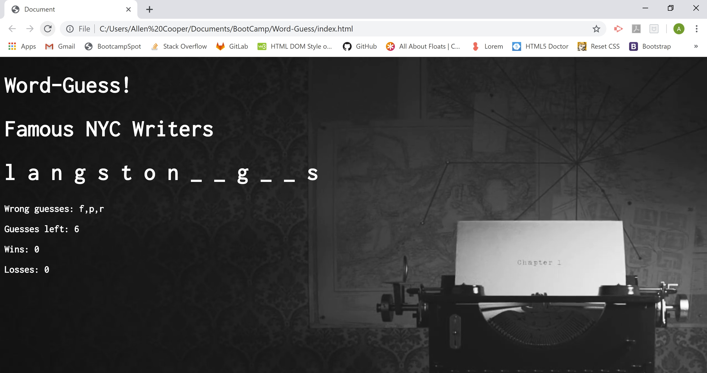

# Word Guess Game

Created a working word-guess game where the user can guess the names of randomly generated NYC writers. 

[https://allendcooper.github.io/Word-Guess/](https://allendcooper.github.io/Word-Guess/)

## Overview

I) Used javascript to build a set of functions to handle a number of commands that do the following:

    1) create a game object that stores a number of properties, including:
        ~wins
        ~losses
        ~remaining attempts
        ~incorrect guesses
        ~bank of possible words to be solved for
        ~the current word to be solved for
        ~the current state of the puzzle.

    2) set up a game when the page loads:
        ~the game sets up a round:
        ~the round updates the game object to set possible attempts to 9, randomly picks a word to be solved for from the word bank, and updates the current state of the puzzle with letter blanks for each letter in the word
        ~the properties of the game object are written to the page

    3) update the round when the user presses a key:
        ~sees if the users guess was a correct match to a letter in the word answer
        ~if correct guess, updates the current state of the puzzle to replace the blanks with the guessed letter in the correct space
        ~if incorrect guess, reduces the number of remaining attempts and adds incorrect letter guess to the object's property.
        ~check to see if the user has lost or won, and if so, ends the round and starts new round
        ~print updates to object property to the page

II) Built html document with a several elements, identified with unique Ids, so that the javascript functions could print to them

III) Used CSS to improve design, including adding a Google font and a background image

## Functionality Breakdown

